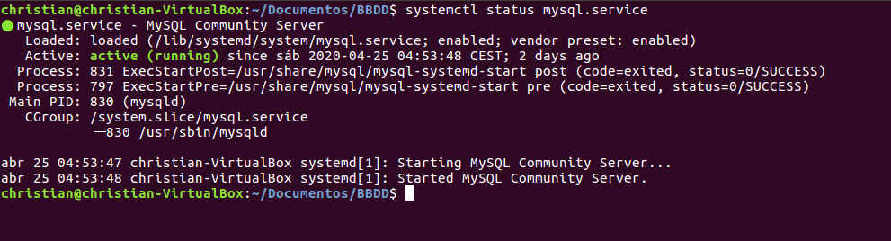
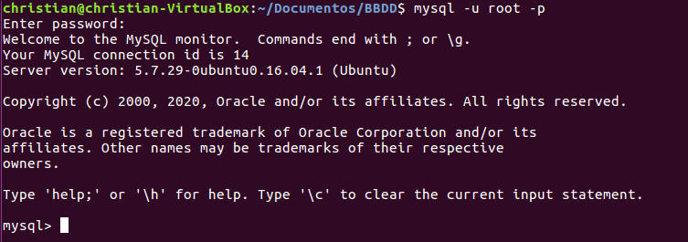
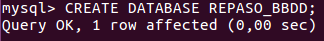
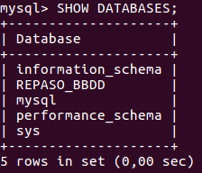
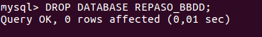
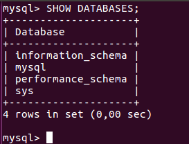

                                                CREACIÓN DE UNA BASE DE DATOS (BBDD)
                                        
# DEFINICIÓN
Una base de datos es una colección organizada de información estructurada, o datos, típicamente almacenados electrónicamente en un sistema informático. Una base de datos generalmente está controlada por un sistema de gestión de bases de datos (SGBD).

Un sistema de administración de bases de datos (SGBD) es un paquete de software diseñado para definir, manipular, recuperar y administrar datos en una base de datos. Un SGBD generalmente manipula los datos en sí, el formato de datos, los nombres de campo, la estructura de registros y la estructura de archivos. También define reglas para validar y manipular estos datos.

Un SGBD libera a los usuarios de los programas de una trama para el mantenimiento de datos. Los lenguajes de consulta de cuarta generación, como SQL, se usan junto con el paquete SGBD para interactuar con una base de datos.

Algunos ejemplos de SGBD son los siguientes:

  - MySQL / MariaDB
  - SQL Server
  - Oracle
  - dBASE
  - FoxPro
  - ...
  
***
***
# ÍNDICE <a name="sql-bbdd_index"></a>
1. ⚡ [ANTES DE LA CREACIÓN](#sql_before-create)
2. ⚡ [CREACIÓN BBDD - PROYECTO DE INVESTIGACIÓN](#sql_proyecto-investigacion)
3. ⚡ [CREACIÓN BBDD - NAVES ESPACIALES](#sql_naves-espaciales)
***

## ANTES DE LA CREACIÓN (REPASO) <a name="sql_before-create"></a>
Antes de nada, revisaremos que el proceso de mysql se está ejecutando correctamente...

Para ello escribiremos el siguiente comando

```console
christian@christian-VirtualBox:~$ systemctl status mysql.service
```


  > Podemos observar que el servicio `MySQL` se está ejecutando correctamente..
  > Systemctl no funciona con el usuario `root`

Lo que haremos ahora, será iniciar el MySQL en modo root (como ya habíamos configurado previamente en SQL_DDL) 😎

Para ello, teclearemos el siguiente comando:

```console
christian@christian-VirtualBox:~$ mysql -u root -p
```

  > Como ya hicimos la autenticación de contraseña para el usuario root, procederemos a usar dicho usuario...

👁 [ÍNDICE](#sql-bbdd_index)

Una vez iniciado con el usuario root, en la shell de MySQL, procederemos a crear una BBDD de prueba...

Para ello en MySQL, teclearemos lo siguiente

```sql
CREATE DATABASE REPASO_BBDD;
```

  > 🛡NOTA: En MySQL, no existe ninguna diferencia entre `CREATE SCHEMA` y `CREATE DATABASE`.
  > En otros SGBD (Ej: Oracle) si existe diferencia (Permisos...)

```sql
SHOW DATABASES;
```


👁 [ÍNDICE](#sql-bbdd_index)

Una vez creada la BBDD anterior, procederemos a eliminarla...

Escribimos 👇

```sql
DROP DATABASE REPASO_BBDD;
```

  > 🛡PELIGRO: Cuidado con la sentencia `DROP`, una vez ejecutada ya no se puede revertir...
  
Y comprobamos 🤞

```sql
SHOW DATABASES;
```


👁 [ÍNDICE](#sql-bbdd_index)

## CREACIÓN BBDD - PROYECTO DE INVESTIGACIÓN <a name="sql_proyecto-investigacion"></a>

Para este paso, crearemos la BBDD paso a paso, explicando la mayor parte de cosas (en lo posible)

Si deseas acceder al ejercicio de *proyecto de investigación*, pincha en este [enlace](https://gist.github.com/christiancf9/cdb0675917f45ac279680d89928ffe5f)


