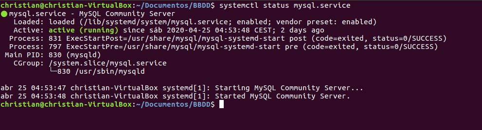

                                                      COMANDOS ÚTILES MySQL 
                                        
# EXPLICACIÓN
Trataremos de enseñar los comandos más utilizados, para MySQL

  
***
***
# ÍNDICE <a name="comandos_index"></a>
1. ⚡ [COMPROBAR ESTADO](#comandos_estado)
2. ⚡ [VER LAS BASES DE DATOS](#comandos_ver-bbdd)
3. ⚡ [VER TABLAS](#comandos_ver-tablas)
4. ⚡ [MOSTRAR INFORMACIÓN - TABLAS](#comandos_desc-tablas)
5. ⚡ [MOSTRAR VERSIÓN DE MYSQL](#comandos_version)
***

## COMPROBAR ESTADO <a name="comandos_estado"></a>

Para comprobar el estado del proceso de MySQL en Ubuntu, escribiremos lo siguiente:

```console
christian@christian-VirtualBox:~$ systemctl status mysql.service
```

  > Podemos observar que el servicio `MySQL` se está ejecutando correctamente..
  > Systemctl no funciona con el usuario `root`

## VER LAS BASES DE DATOS <a name="comandos_ver-bbdd"></a>

Con este sencillo comando, visualizaremos las bases de datos `BBDD` creadas en este SGBD.

```sql
SHOW DATABASES;
```

