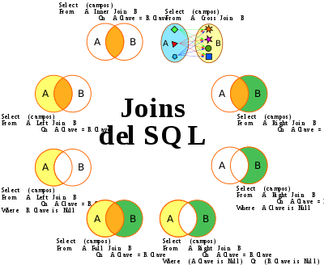

                                                SENTENCIA DQL
                                              
**SELECT** nos permite consultar los datos almacenados.

```SQL
SELECT
    <nombre_campo> 
FROM
    <nombre_tabla>
WHERE 
    <condicion>;
```

**FROM** nos indica que los datos serán recuparados de una tabla. Se pueden introducir varias tablas en las subconsultas o consultas combinadas

```SQL
SELECT
     *
FROM
   coches
WHERE 
    marca, modelo;
```

**WHERE** nos permite filtrar el resultado de una clausula `SELECT`

```SQL
    SELECT 
          matricula, 
          marca,
          modelo,
          color,
          numero_kilometros,
          num_plazas 
FROM 
   coches
WHERE 
    matricula = '1234CCF';
```

**ORDER BY** permite especificar el orden de los datos a ser devueltos.

```SQL
    SELECT 
          matricula, 
          marca,
          modelo,
          color,
          numero_kilometros,
          num_plazas 
FROM 
   coches
ORDER BY marca ASC, modelo DESC;
```
                                          CONSULTAS COMBINADAS (JOINS)





**JOIN** permite unir dos o más tablas. Se definiría como un producto cartesiano. Existen diferentes tipos:

1. JOIN
   - LEFT  [OUTER] JOIN --> Ignora los valores del lado _derecho_ igual que los valores del lado izq. que no son nulos
   - RIGHT [OUTER] JOIN --> Ignora los valores del lado _izquierdo_ igual que los valores del lado der. que no son nulos
   - INNER JOIN         --> Une todos los valores, tanto del lado _izquierdo_ como _derecho_

**INNER JOIN** 👇

```SQL
    SELECT 
          coches.matricula, 
          coches.marca,
          coches.modelo,
          coches.color,
          coches.numero_kilometros,
          coches.num_plazas 
          motos.marca
FROM 
   coches
INNER JOIN motos ON coches.marca = motos.marca;
```

**LEFT/RIGHT JOIN** 👇

```SQL
    SELECT 
          coches.matricula, 
          motos.matricula
FROM 
   coches
LEFT JOIN motos ON coches.matricula = motos.matricula;
```

                                             CONSULTAS AGREGADAS
                                       
**GROUP BY** nos agrupa los registros idénticos en 1 único registro

```SQL
SELECT
     marca, modelo, SUM(numero_km)
FROM
   coches
WHERE 
    marca
GROUP BY
       marca, modelo;
```

**HAVING** similar a `WHERE`, determina los registros a seleccionar. Permite el uso de varias funciones agregadas...

```SQL
SELECT
     marca, modelo, SUM(numero_km)
FROM
   coches
WHERE 
    marca <> 'MERCEDES'
GROUP BY
       marca, modelo
HAVING SUM(numero_km) > 75000;
```

**AVG** indica la media aritmética de un par o conjunto de valores en un campo específico.

```SQL
SELECT
     marca, modelo, AVG(numero_km)
FROM
   coches
GROUP BY
       marca, modelo;
```

**COUNT** calcula el nº de registros o campos devueltos por una consulta. 

```SQL
SELECT
     marca, COUNT(modelo)
FROM
   coches
GROUP BY
       marca;
```

**Max, Min** devuelve tanto el mínimo o el máximo de un conjunto/par de valores contenidos en un campo específico

```SQL
SELECT
     marca, modelo, MIN(numero_km),
     MAX(numero_km)
FROM
   coches
GROUP BY
       marca, modelo;
```

**SUM** devuelve la suma del conjunto de valores contenidos en el campo...

```SQL
SELECT
     marca, modelo, SUM(numero_km)
FROM
   coches
GROUP BY
       marca, modelo;
```
